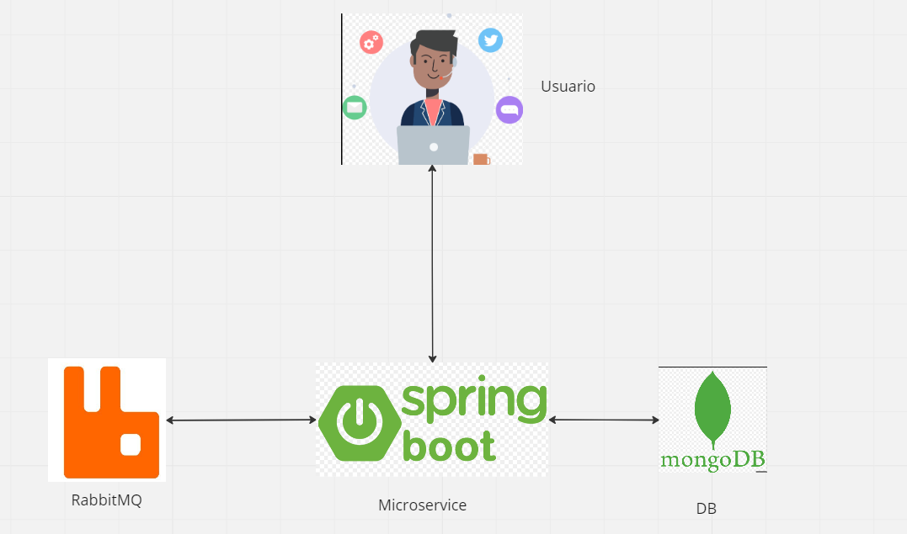
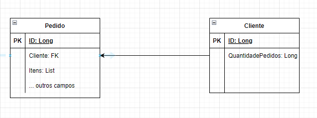

# Desafio BTG

### Desenho de solução:

### Banco de Dados:

### Tecnologias utilizadas:

 - JAVA 17 (https://www.oracle.com/java/technologies/javase/jdk17-archive-downloads.html)
 - DOCKER (https://www.docker.com/products/docker-desktop/)
 - MONGODB (https://www.mongodb.com/)
 - RABBITMQ (https://www.rabbitmq.com/)

Atendendo os requisitos acima basta rodar o comando abaixo para subir as imagens no docker

### Habilitando plugin Shovel

- rabbitmq-plugins enable rabbitmq_shovel, **Executar dentro do terminal do rabbit**

#### Subindo os containers
 - docker-compose up -d

#### Parar container
 - docker-compose stop

### Swagger

 - http://localhost:8080/swagger-ui/#/
